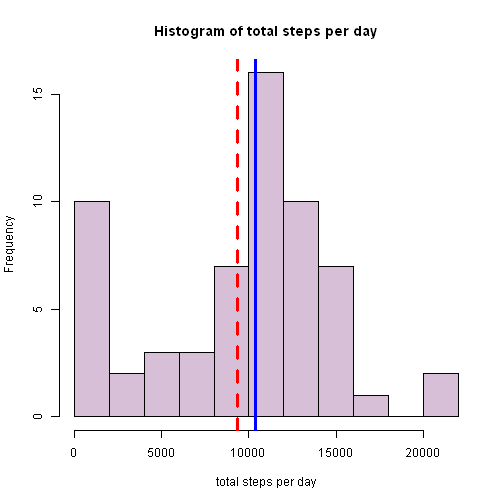
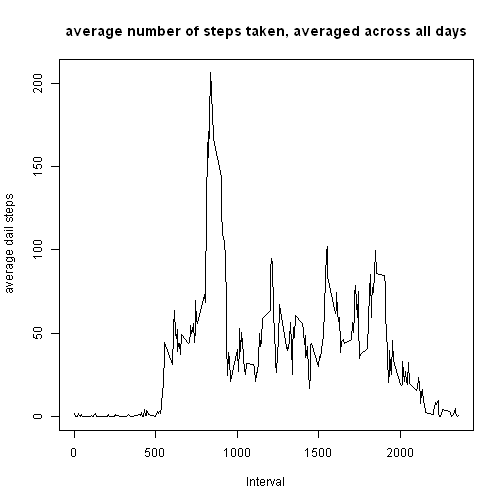
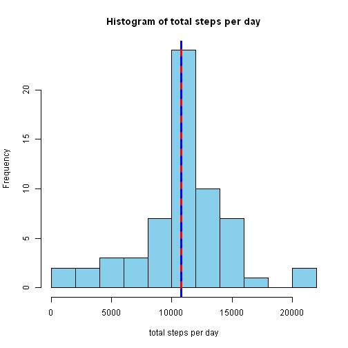
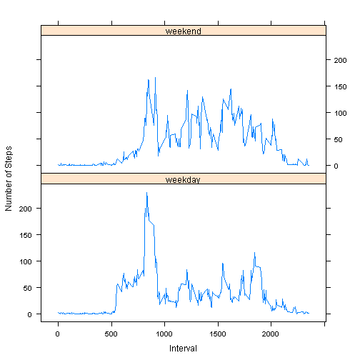

RepData_PeerAssessment1
=======================

First load the data and look at the head, structure and summary to see what we have

```r
unzip("activity.zip",
exdir = "data")
data<-read.csv("./data/activity.csv")
head(data)
```

```
##   steps       date interval
## 1    NA 2012-10-01        0
## 2    NA 2012-10-01        5
## 3    NA 2012-10-01       10
## 4    NA 2012-10-01       15
## 5    NA 2012-10-01       20
## 6    NA 2012-10-01       25
```

```r
str(data)
```

```
## 'data.frame':	17568 obs. of  3 variables:
##  $ steps   : int  NA NA NA NA NA NA NA NA NA NA ...
##  $ date    : Factor w/ 61 levels "2012-10-01","2012-10-02",..: 1 1 1 1 1 1 1 1 1 1 ...
##  $ interval: int  0 5 10 15 20 25 30 35 40 45 ...
```

```r
summary(data)
```

```
##      steps                date          interval     
##  Min.   :  0.00   2012-10-01:  288   Min.   :   0.0  
##  1st Qu.:  0.00   2012-10-02:  288   1st Qu.: 588.8  
##  Median :  0.00   2012-10-03:  288   Median :1177.5  
##  Mean   : 37.38   2012-10-04:  288   Mean   :1177.5  
##  3rd Qu.: 12.00   2012-10-05:  288   3rd Qu.:1766.2  
##  Max.   :806.00   2012-10-06:  288   Max.   :2355.0  
##  NA's   :2304     (Other)   :15840
```
What is mean total number of steps taken per day?
-------------------------------------------------
Group the data by the date variable and calculate the total daily steps first loading the dplyr library


```r
## install.packages("dplyr") if not already installed

library(dplyr)
```

```
## 
## Attaching package: 'dplyr'
## 
## The following object is masked from 'package:stats':
## 
##     filter
## 
## The following objects are masked from 'package:base':
## 
##     intersect, setdiff, setequal, union
```

```r
grdate<-group_by(data,date)
sumstep<-summarise(grdate,dailyTotal=sum(steps,na.rm=TRUE))
summary(sumstep)
```

```
##          date      dailyTotal   
##  2012-10-01: 1   Min.   :    0  
##  2012-10-02: 1   1st Qu.: 6778  
##  2012-10-03: 1   Median :10395  
##  2012-10-04: 1   Mean   : 9354  
##  2012-10-05: 1   3rd Qu.:12811  
##  2012-10-06: 1   Max.   :21194  
##  (Other)   :55
```

Create a historgram of the total daily steps showing the mean (red) and median (blue)


```r
hist(sumstep$dailyTotal,breaks=10,col="thistle",xlab="total steps per day",main="Histogram of total steps per day")
abline(v = mean(sumstep$dailyTotal), col="red", lwd=3, lty=2)
abline(v = median(sumstep$dailyTotal), col="Blue", lwd=3, lty=1)
```

 
  
  
*Report the mean and the median daily total steps*


```r
mean_dailyTotal<-mean(sumstep$dailyTotal)
median_dailyTotal<-median(sumstep$dailyTotal)
mean_dailyTotal
```

```
## [1] 9354.23
```

```r
median_dailyTotal
```

```
## [1] 10395
```

What is the average daily activity pattern?
-------------------------------------------

*Make a time series plot (i.e. type = "l") of the 5-minute interval (x-axis) and the average number of steps taken, averaged across all days (y-axis)*

by grouping the data by interval (288 five min intervals is equal to one day) and calculating the mean steps will give us the average number of steps taken, averaged across all days to create the time series plot

```r
grint<-group_by(data,interval)
intstep<-summarise(grint,dailyAve=mean(steps,na.rm=TRUE))
head(intstep)
```

```
## Source: local data frame [6 x 2]
## 
##   interval  dailyAve
## 1        0 1.7169811
## 2        5 0.3396226
## 3       10 0.1320755
## 4       15 0.1509434
## 5       20 0.0754717
## 6       25 2.0943396
```

creat the time series plot


```r
plot(intstep$interval,intstep$dailyAve,type="l",xlab="Interval",ylab="average dail steps", main="average number of steps taken, averaged across all days")
```

 

*Which 5-minute interval, on average across all the days in the dataset, contains the maximum number of steps?*

```r
p<-which.max(intstep$dailyAve)
intstep[p,]
```

```
## Source: local data frame [1 x 2]
## 
##   interval dailyAve
## 1      835 206.1698
```

*Calculate and report the total number of missing values in the dataset (i.e. the total number of rows with NAs)*

```r
g<-which(is.na(data$steps))
length(g)
```

```
## [1] 2304
```

*Devise a strategy for filling in all of the missing values in the dataset.*

*Create a new dataset that is equal to the original dataset but with the missing data filled in.*
First create a copy of the data

```r
newdata<-data
```

Using the intstep dailyAve variable from the previous question create a new variable of the average steps per 5 minuet interval and look at the summary of the new data frame to check it.


```r
dailyAve<-intstep$dailyAve
newdata$dailyAve<-dailyAve
summary(newdata)
```

```
##      steps                date          interval         dailyAve      
##  Min.   :  0.00   2012-10-01:  288   Min.   :   0.0   Min.   :  0.000  
##  1st Qu.:  0.00   2012-10-02:  288   1st Qu.: 588.8   1st Qu.:  2.486  
##  Median :  0.00   2012-10-03:  288   Median :1177.5   Median : 34.113  
##  Mean   : 37.38   2012-10-04:  288   Mean   :1177.5   Mean   : 37.383  
##  3rd Qu.: 12.00   2012-10-05:  288   3rd Qu.:1766.2   3rd Qu.: 52.835  
##  Max.   :806.00   2012-10-06:  288   Max.   :2355.0   Max.   :206.170  
##  NA's   :2304     (Other)   :15840
```

Replace the NA's in the steps variable with equivilant average steps for the time interval using the row numbers of NA's (g) calculated in earlier step and remove the dailyAve variable. with which(is.na) we can see that the NA's have been removed.


```r
newdata[g,1]<-newdata[g,4]
newdata<-newdata[,1:3]
which(is.na(newdata))
```

```
## integer(0)
```

```r
summary(newdata)
```

```
##      steps                date          interval     
##  Min.   :  0.00   2012-10-01:  288   Min.   :   0.0  
##  1st Qu.:  0.00   2012-10-02:  288   1st Qu.: 588.8  
##  Median :  0.00   2012-10-03:  288   Median :1177.5  
##  Mean   : 37.38   2012-10-04:  288   Mean   :1177.5  
##  3rd Qu.: 27.00   2012-10-05:  288   3rd Qu.:1766.2  
##  Max.   :806.00   2012-10-06:  288   Max.   :2355.0  
##                   (Other)   :15840
```

 Make a histogram of the total number of steps taken each day and Calculate and report the mean and median total number of steps taken per day.
---------------------------------------------------------------------
using the same method as before we can create a histogram of the total steps per day with the NA's replaced

```r
newgrdate<-group_by(newdata,date)
newsumstep<-summarise(newgrdate,dailyTotal=sum(steps))
summary(newsumstep)
```

```
##          date      dailyTotal   
##  2012-10-01: 1   Min.   :   41  
##  2012-10-02: 1   1st Qu.: 9819  
##  2012-10-03: 1   Median :10766  
##  2012-10-04: 1   Mean   :10766  
##  2012-10-05: 1   3rd Qu.:12811  
##  2012-10-06: 1   Max.   :21194  
##  (Other)   :55
```

```r
hist(newsumstep$dailyTotal,breaks=10,col="skyblue",xlab="total steps per day",main="Histogram of total steps per day")
abline(v = mean(newsumstep$dailyTotal), col="red", lwd=3, lty=1)
abline(v = median(newsumstep$dailyTotal), col="Blue", lwd=3, lty=2)
```

 

*Calculate and report the mean and median total number of steps taken per day.*


```r
mean_newdailyTotal<-mean(newsumstep$dailyTotal)
median_newdailyTotal<-median(newsumstep$dailyTotal)
mean_newdailyTotal
```

```
## [1] 10766.19
```

```r
median_newdailyTotal
```

```
## [1] 10766.19
```

*Do these values differ from the estimates from the first part of the assignment? What is the impact of imputing missing data on the estimates of the total daily number of steps?*

By replacing missing data with interval averages, the values differ in new data set, there is a lower frequency of days with total steps of below 4,000, and a higher frequency of days with total steps between 10,000 and 20,00. The median and mean also increase and merge at 10766.19 steps perday.

Are there differences in activity patterns between weekdays and weekends?
-------------------------------------------------------------------------
First create a weekday.end factor veriable

```r
newdata$week.end<-"weekday"

library(timeDate)

wd<-isWeekend(newdata$date)
newdata[wd,4]<-"weekend"
newdata$week.end<-factor(newdata$week.end)
table(newdata[,4])
```

```
## 
## weekday weekend 
##   12960    4608
```

*Make a panel plot containing a time series plot (i.e. type = "l") of the 5-minute interval (x-axis) and the average number of steps taken, averaged across all weekday days or weekend days (y-axis).*

Group the newdata by interval and week.end then summarise the mean number of steps.


```r
newgr<-group_by(newdata, interval, week.end)
avst<-summarise(newgr,avesteps=mean(steps))
```
Have a look at the data

```r
head(avst)
```

```
## Source: local data frame [6 x 3]
## Groups: interval
## 
##   interval week.end   avesteps
## 1        0  weekday 2.25115304
## 2        0  weekend 0.21462264
## 3        5  weekday 0.44528302
## 4        5  weekend 0.04245283
## 5       10  weekday 0.17316562
## 6       10  weekend 0.01650943
```

```r
str(avst)
```

```
## Classes 'grouped_df', 'tbl_df', 'tbl' and 'data.frame':	576 obs. of  3 variables:
##  $ interval: int  0 0 5 5 10 10 15 15 20 20 ...
##  $ week.end: Factor w/ 2 levels "weekday","weekend": 1 2 1 2 1 2 1 2 1 2 ...
##  $ avesteps: num  2.2512 0.2146 0.4453 0.0425 0.1732 ...
##  - attr(*, "vars")=List of 1
##   ..$ : symbol interval
##  - attr(*, "drop")= logi TRUE
```

create the plot using the laticce package


```r
library(lattice)


xyplot(avesteps~interval | week.end, data = avst,
       type = 'l',
       xlab = 'Interval',
       ylab = 'Number of Steps',
       layout = c(1,2))
```

 

